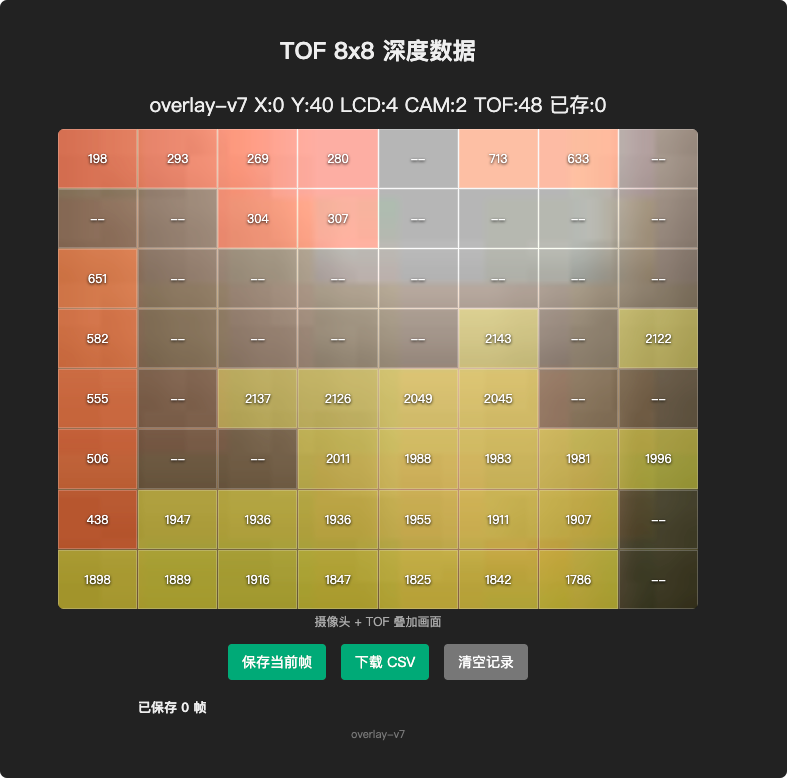

# unihiker-k10-8x8

**中文** | [English](README_EN.md)

在行空板 K10(UNIHIKER K10)上,将 DFRobot MatrixLidar TOF 传感器的 8x8 深度数据以彩色网格形式实时叠加到摄像头画面上。

## 效果

- 摄像头实时画面作为背景
- 8x8 深度网格叠加显示,颜色表示距离:
  - 红色 = 近
  - 绿色 = 中距离
  - 蓝色 = 远
  - 深灰 = 无效数据(0 或超过 3500mm)
- 顶栏显示当前校准偏移量和刷新帧率
- WiFi 网页端实时查看 8x8 深度数据,可在线保存帧并导出 CSV

### 实拍画面



K10 实际运行画面（`overlay-v7`，由 PlatformIO 编译上传）：摄像头图像与 TOF 8x8 深度数据在浏览器中实时叠加，页面同时显示本机绘制、浏览器相机和 TOF 采样帧率。

## 硬件

- 行空板 K10(UNIHIKER K10)
- DFRobot MatrixLidar TOF 传感器(I2C,地址 `0x31`,400kHz)

## 依赖库

- `unihiker_k10`
- `DFRobot_MatrixLidar`
- `WiFi`、`WebServer`(K10 开发板包自带)

## 使用

### PlatformIO（推荐）

仓库已包含 `platformio.ini`，使用 DFRobot 官方 `unihiker_k10` 板卡平台。PlatformIO 会缓存工具链、开发板框架和依赖库，首次完整编译后，后续修改会使用增量编译。

首次使用时复制 WiFi 配置模板并填入本机配置。`wifi_secrets.h` 已被 Git 忽略，不会把密码提交到 GitHub：

```bash
cp include/wifi_secrets.h.example include/wifi_secrets.h
```

```bash
# 编译
pio run

# 编译并上传到 K10
pio run --target upload

# 查看串口输出
pio device monitor
```

若命令行找不到 `pio`，可先安装 [PlatformIO Core](https://platformio.org/install/cli)，或直接用 VS Code 的 PlatformIO IDE 打开本仓库。`src/main.cpp` 只负责引入 `tof-camera-overlay/tof-camera-overlay.ino`，Arduino IDE 与 PlatformIO 共用同一份固件源码。

### Arduino IDE

用 Arduino IDE 打开 `tof-camera-overlay/tof-camera-overlay.ino`,选择行空板 K10 开发板编译上传即可。

### WiFi 网页

1. PlatformIO 使用 `include/wifi_secrets.h` 配置 WiFi；Arduino IDE 可直接修改代码顶部的默认值。没有提供配置时，固件会尝试连接 ESP32 NVS 中已经保存的网络。
2. 上传后,K10 连接 WiFi 成功会在屏幕第二行显示 IP 地址(串口也会打印)。
3. 浏览器访问 `http://<K10的IP>`,即可看到摄像头画面与 8x8 深度网格的实时叠加视图。相机帧在上一帧完成后立即请求，实际帧率取决于 WiFi 与 JPEG 编码速度。状态栏的 `LCD` 是本机屏幕绘制帧率，`CAM` 是浏览器实际接收的相机帧率，`TOF` 是传感器采样帧率。
4. 网页功能:
   - **保存当前帧**:把当前 8x8 数据和一张摄像头照片存入设备(环形缓冲,最多 50 帧,掉电丢失,照片存于 PSRAM)
   - **下载 CSV**:把已保存的帧导出为 CSV 文件
   - **清空记录**:清除已保存的帧和照片
   - 已保存列表中点击缩略图可查看对应照片大图
5. WiFi 在后台非阻塞连接；即使未配置或连接失败，本机摄像头与 TOF 网格也会立即运行，网页暂不可用。离线时每 10 秒自动重连。
6. 新版页面状态栏会显示 `overlay-v7`，并且禁止浏览器缓存；若未看到该标识，说明设备仍在运行旧固件。

### 校准模式

网格位置可通过按键微调,使其与摄像头画面对齐:

| 按键 | 短按 | 长按(>500ms) |
|------|------|---------------|
| A    | X 偏移 +2 | X 偏移 -2 |
| B    | Y 偏移 +2 | Y 偏移 -2 |

默认偏移为 `X:0, Y:40`,每个网格单元 28x28 像素。摄像头与深度数据均使用传感器原始方向，相比旧版显示方向转了 180°。

## 实现说明

- 本机网格目标每 50ms 刷新一次(`DRAW_INTERVAL`，实际帧率受 TOF 采样速度限制)
- 只重绘颜色发生变化的网格单元,减少刷屏开销
- TOF 同步 I2C 读取在独立 FreeRTOS 任务中运行，不再阻塞网页、相机请求和按键响应
- 实时相机帧先从 320x240 降采样到 160x120，再转换为 JPEG，将软编码像素量降到 1/4，同时保持较小的 WiFi 传输量
- WebServer 运行在独立 FreeRTOS 任务中，相机帧请求无需排队等待本机屏幕刷新
- WiFi 连接与重连完全非阻塞，网络不可用时不会延迟本机首帧显示
